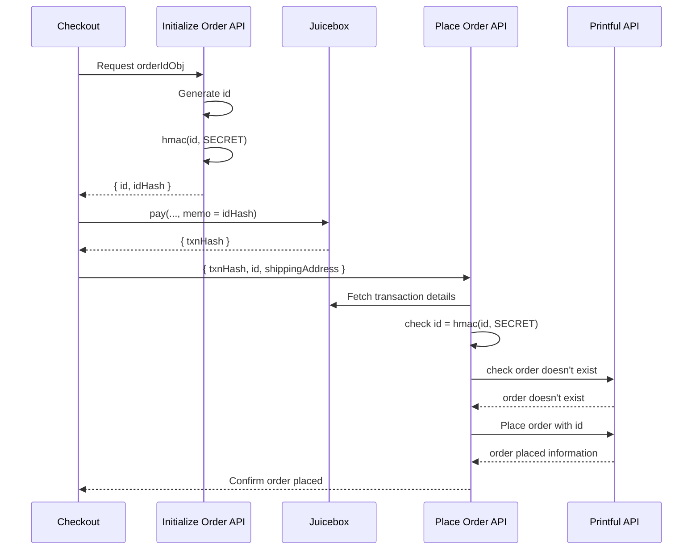

# 🍩
donutshop is a simple way to connect a juicebox project to a [printful](https://printful.com) store

built with:
 * [nextjs app router](https://nextjs.org/docs/app)
 * [tailwindcss](https://tailwindcss.com)
 * [wagmi.sh](https://wagmi.sh)
 * [connectkit](https://docs.family.co)
 * [walletconnect](https://walletconnect.com)
 * [infura](https://www.infura.io)
 * [printful api](https://developers.printful.com/docs/)
 * [juicebox pay](https://docs.juicebox.money/dev/api/contracts/or-payment-terminals/or-abstract/jbpayoutredemptionpaymentterminal3_1_1/#pay)

## Setup
> [!IMPORTANT]
> This is still a work in progress. Product images and printful products are hardcoded. The next steps are to make these dynamic and configurable.

1. Clone the repo
2. ```npm install```
3. ```cp blank.env.local .env.local```
4. Create a [printful](https://www.printful.com) account and store
5. Login with same account and create [printful private token](https://developers.printful.com) ([help](/docs/printful_developer_home.png))
6. Name the token, add an email (required), set expiration date, and set minimum scopes shown below, add to `.env.local` ([help](/docs/printful_token.png))
7. Create a wallet connect project and add to `.env.local`
8. Create an infura API key and add to `.env.local`
9. Create a upstash redis instance and add to `.env.local` (used to track order nonces)
10. Set the `NEXT_PUBLIC_JUICEBOX_PROJECT_ID` in `.env.local` to the juicebox project id ([help](/docs/juicebox.png))
11. Deploy!

## Ordering sequence

